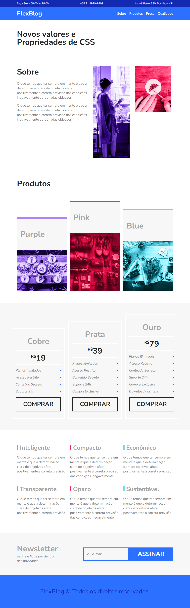

# 🧩 FlexBlog

Projeto desenvolvido durante o curso **CSS Flexbox** da [Origamid](https://www.origamid.com/), com o objetivo de aplicar na prática os principais conceitos e propriedades do Flexbox.



## 📚 Sobre o Projeto

O **FlexBlog** é um site fictício que simula um blog moderno, com layout 100% responsivo e estruturado com HTML5 e CSS3, utilizando **Flexbox** para organizar os elementos na página.

O projeto inclui diversas seções típicas de um site comercial, como:

- Informações de contato no topo
- Menu de navegação fixo
- Seção "Sobre"
- Galeria de produtos
- Tabela de preços
- Blocos de qualidade
- Newsletter
- Rodapé

## 🧠 Tecnologias e Conceitos Utilizados

- HTML5 semântico
- CSS3
- Flexbox (display: flex)
- Responsividade com media queries
- Layouts flexíveis e alinhamentos
- Boas práticas de estruturação

## 💡 Objetivo do Curso

O curso de Flexbox da Origamid foi fundamental para entender:

- Como alinhar elementos com `justify-content` e `align-items`
- A diferença entre `flex-direction`, `flex-wrap`, `flex-grow` e `flex-shrink`
- Como criar layouts modernos sem precisar de float ou grid
- Aplicações reais do Flexbox em projetos web

## 🖼️ Visual do Projeto

O site possui um visual moderno com fontes do Google Fonts e organização visual clara e bem distribuída entre os elementos. Confira algumas seções:

- **Introdução e chamada principal**
- **Cards de produtos com imagens**
- **Planos de preços**
- **Seção de qualidades com ícones**

## 🚀 Como Visualizar

1. Clone o repositório:
```bash
git clone https://github.com/albertodevweb/Origamid/tree/main/FlexBox
```
2. Estrutura das Pastas:
flexblog/
│
├── css/
│   └── style.css
├── img/
│   ├── sobre1.jpg
│   ├── sobre2.jpg
│   └── produtos1.jpg ...
└── index.html